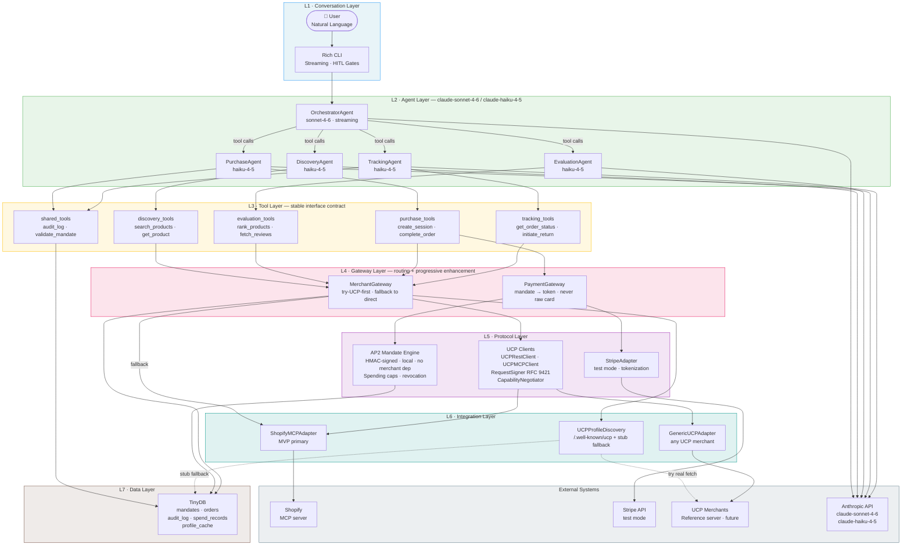
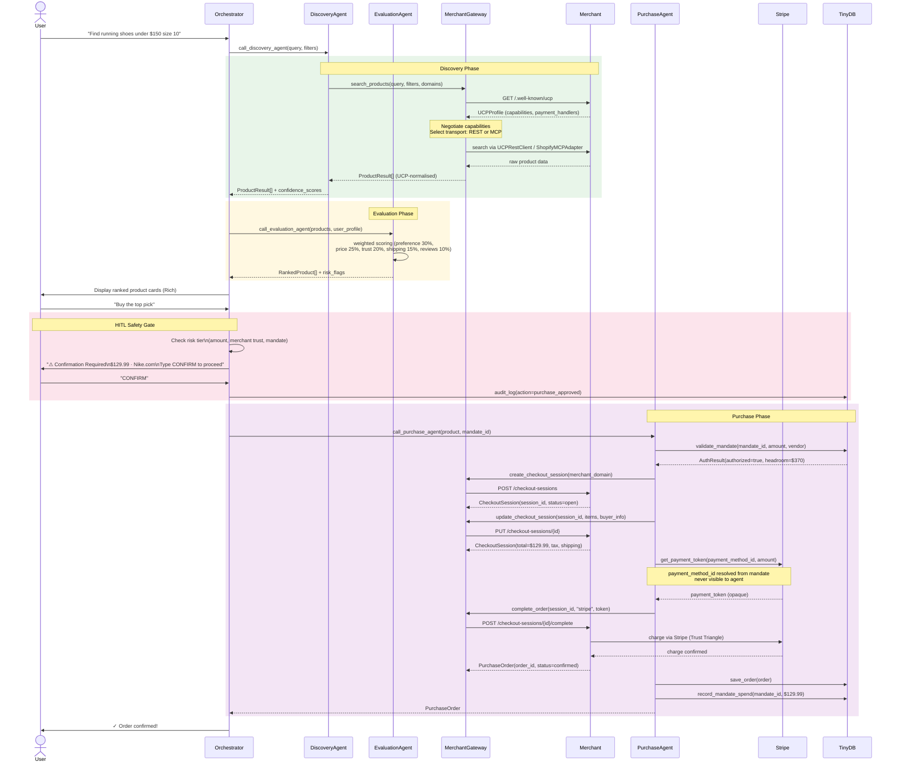
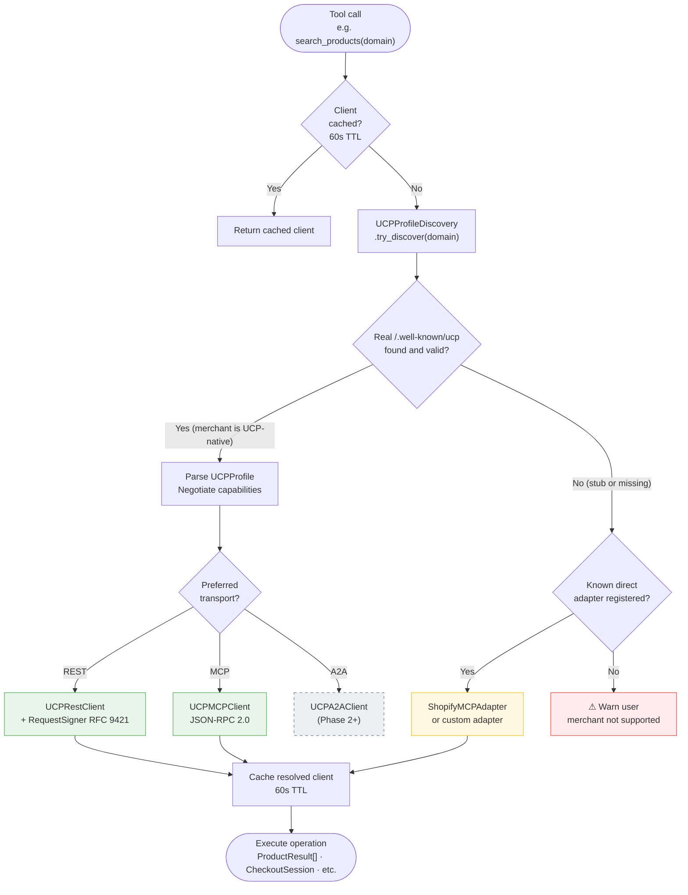
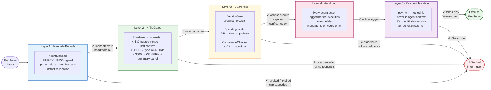
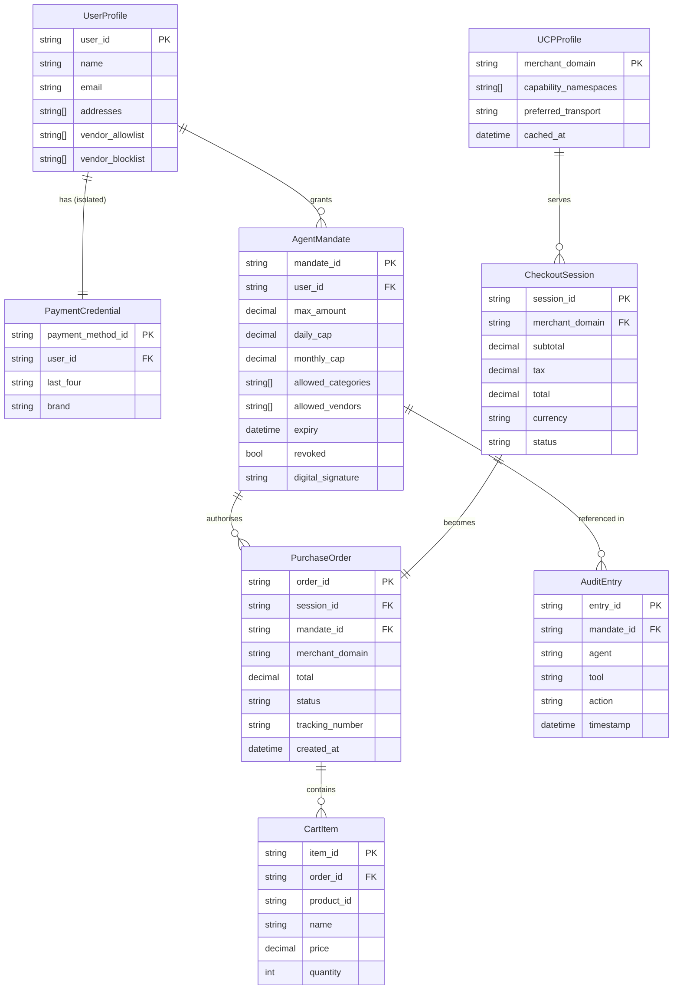
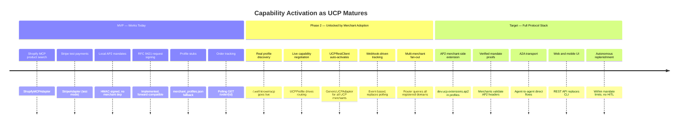
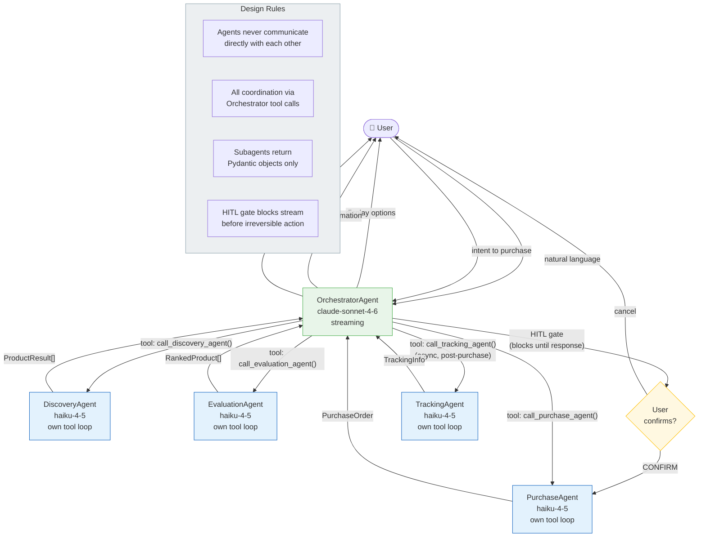

# Agentic Commerce — Architecture Diagrams

> Companion to ARCHITECTURE.md. All diagrams render in GitHub, VS Code (Markdown Preview), and any Mermaid-compatible viewer.
> Last updated: 2026-05-10

---

## 1. System Layer Overview

The full system from user to external APIs, showing all seven layers and how they connect.

---

## 2. Purchase Flow — Sequence Diagram

End-to-end lifecycle of a single purchase from user intent to order confirmation.

---

## 3. MerchantGateway — Routing Logic

How the gateway resolves which client to use for any merchant domain. This is the core progressive enhancement mechanism.

---

## 4. Safety Architecture — Defence in Depth

Five independent layers of protection. A purchase must pass all five.

---

## 5. Data Model Relationships

Core entities and how they relate. `payment_method_id` is shown isolated — it never crosses into agent-visible entities.

---

## 6. Progressive Enhancement Timeline

What works today vs what activates as UCP merchant adoption grows.

---

## 7. Agent Interaction Model

How the Orchestrator coordinates subagents via tool calls, and where humans stay in the loop.

---

*Diagrams render with [Mermaid](https://mermaid.js.org). Open this file in GitHub, VS Code with Markdown Preview Enhanced, or [mermaid.live](https://mermaid.live) to view rendered output.*
